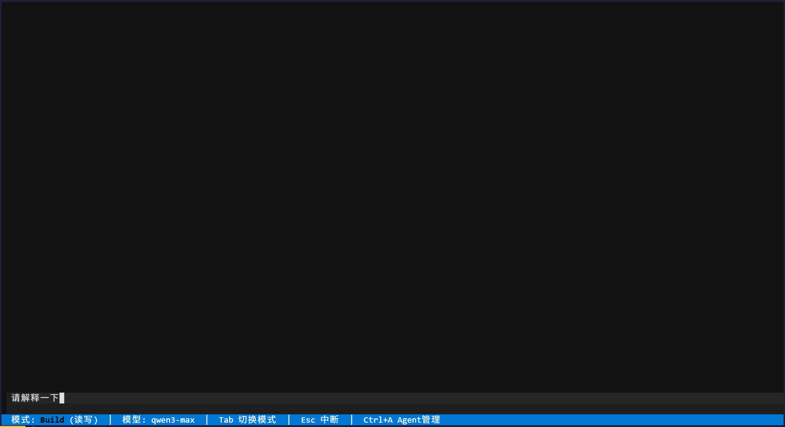

# Mini Claude Code

[](https://github.com/liver0377/mini_cc/actions/workflows/ci.yml)
[](https://www.python.org/)
[](https://docs.astral.sh/ruff/)
[](LICENSE)

[**中文文档**](docs/README_zh.md)

> A lightweight multi-agent collaborative coding assistant CLI built in pure Python.

## Vision

Mini Claude Code aims to build a lightweight, extensible command-line coding agent in pure Python. It supports multi-agent collaboration and can understand natural language instructions to automatically complete tasks such as code writing, file operations, and test execution.

## Demo



## Features

- [x] Multi-agent collaboration & communication (AgentManager, SubAgent, event system)
- [x] File Tool, Shell Tool, Glob/Grep...
- [x] TUI interface
- [x] Sub-Agent worktree isolation
- [x] File snapshot rollback
- [x] Plan/Build mode switching
- [x] Async agent loop + streaming output
- [x] OpenAI-compatible provider
- [x] Interrupt/cancel support
- [ ] Automatic task decomposition & scheduling
- [x] Short-term / long-term memory
- [ ] Session persistence
- [x] Automated testing & static analysis integration
- [ ] Slash commands
- [x] Context compression
- [ ] Sandbox

## Codebase

Pure Python, only ~3000 lines of code.

```txt
(.venv) ➜  mini_cc git:(main) cloc src
      52 text files.
      52 unique files.                              
      49 files ignored.

github.com/AlDanial/cloc v 1.98  T=0.12 s (419.5 files/s, 33141.6 lines/s)
-------------------------------------------------------------------------------
Language                     files          blank        comment           code
-------------------------------------------------------------------------------
Python                          48            742            175           3065
Markdown                         4             35              0             91
-------------------------------------------------------------------------------
SUM:                            52            777            175           3156
-------------------------------------------------------------------------------
```

## Tech Stack

### Core Dependencies

| Technology | Purpose |
| --- | --- |
| Python 3.11+ | Core language |
| uv | Package manager & virtual environment |
| Typer | CLI framework |
| Pydantic | Data validation & model definitions |
| Textual | TUI framework |
| bubblewrap | Sandbox |

### Engineering Quality

| Tool | Purpose |
| --- | --- |
| Ruff | Formatting & linting |
| mypy | Type checking |
| pytest, pytest-asyncio | Unit testing |
| pre-commit | Git hooks |
| commitizen | Commit message convention |
| GitHub Actions | CI |

## Getting Started

This project only supports Linux/WSL.

```bash
# Install dependencies
uv sync

# Launch TUI (default)
mini-cc tui

# Or launch REPL
mini-cc chat
```

## License

[MIT](LICENSE)
